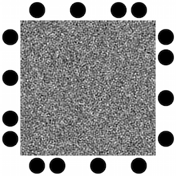

# FOCUS #

FOCUS codes are visual codes that are very robust to unfavorable capture
conditions. By carefully representing data in the frequency domain rather than
in blocks of pixels (as [barcodes](https://en.wikipedia.org/wiki/Barcode) do),
FOCUS codes can be read over longer distances, with poorer cameras, and are
relatively robust to blur. To learn more about FOCUS, please refer to our
[MobiSys '16 paper](http://frederik.io/publications/hermans16focus.pdf).

This repository contains the FOCUS core libraries to get you started with
creating and decoding FOCUS codes. These libraries are licensed under the [BSD
3-clause license](COPYING).

To satisfy your curiosity, here is an example of a FOCUS code:

Authors: Frederik Hermans (frederik.hermans@it.uu.se), Liam McNamara (ljjm@sics.se)

## Installation ##

Start by installing OpenCV and libfftw, two external dependencies. Also make
sure that you can compile Python modules that use C. On a Debian-like system:

    sudo apt-get install libfftw3-3 libfftw3-double3 libfftw3-long3 libfftw3-single3 libfftw3-dev
    sudo apt-get install libopencv-core* python-opencv
    sudo apt-get install python-dev

Note that installing python-opencv using apt-get will also install
python-numpy, which FOCUS also depends on. There are a number of additional
dependencies. I haven't yet found a good way to satisfy all these dependencies
automatically, so you will have to install them manually:

    sudo pip install click pyfftw Pillow

Next, clone the repositories for FOCUS, imageframer (used for detecting
codes in a photo) and rscode (used for Reed-Solomon coding) and install the
packages:

    git clone https://github.com/frederikhermans/imageframer
    pip install -e imageframer
    git clone https://github.com/frederikhermans/rscode
    pip install -e rscode
    git clone https://github.com/frederikhermans/focus
    pip install -e focus

At this point, a script called `focus` is available in `$HOME/.local/bin`.
Make sure that this directory is on your path.

    export PATH=$HOME/.local/bin:$PATH

Now create an FFT wisdom file to speed up encoding and decoding:

    focus fft_init

Finally, run the tests to make sure that everything works as expected

    $ focus test
    Succeeded: 8/8

Yay!

### Missing libraries ###

If your system does not have the required dependencies easily available (e.g.,
Android, older Debian versions on Raspberry Pi or Beaglebone), you need to
compile the libraries manually.

To compile libfftw3-long3 on older Debian versions that don't have the package:

    wget http://www.fftw.org/fftw-3.3.4.tar.gz
    tar xvfz fftw-3.3.4.tar.gz
    cd fftw-3.3.4
    ./configure --enable-long-double && make && sudo make install
    ./configure --enable-long-double --enable-threads && make && sudo make install

To compile the libraries for Android, you need a [Kivy development
environment](https://github.com/kivy/python-for-android) to build a Python
executable and library that runs on Android. Make sure to use our [optimized
OpenCV version](https://github.com/frederikhermans/opencv), which uses NEON
extensions for `warpPerspective` and builds Python modules even when compiled
for Android.

## Getting started ##

Use the command `focus simpletx` to create a PNG file for a given payload.

     $ echo -n "This is my first FOCUS code." | focus simpletx first.png
     Wrote code with 1 sub-channel(s).

Next, try to simply decode the code we have just created:

     $ focus simplerx --nsubchannels 1 first.png
     Receiver initialized
     Payload: <<<This is my first FOCUS code.>>>
     Status: all-decoded
     Number of decoded fragments: 1

Now, display the code on your monitor (or print it) and take a photo with your
cell phone. Decode that photo. Here's an image you can try:

     wget http://frederik.io/focus/test-photo.jpg 
     focus simplerx --nsubchannels 22 test-photo.jpg

### Screen/camera links aka video ###

To generate and decode sequences of FOCUS codes (i.e., what the paper refers to
as "screen/camera links"), you can use the `focus videotx` and `focus videorx`
commands. Here is an example that generates 300 KByte of data and encodes it
in a 10 second sequence of codes.

    dd if=/dev/urandom of=txpayload bs=$((64*32)) count=$((10*15))
    focus videotx --nsubchannels 32 example.mp4 < txpayload
    focus videorx --nsubchannels 32 example.mp4 > rxpayload

When you look at the rxpayload file, you will find that it contains twice as
much data as txpayload. This is because the video has a frame rate of 30 FPS,
whereas we are sending codes at a rate of only 15 FPS. Thus, `videorx` will
decode each code twice.

Note that FOCUS does not define a header format. It is up to your application
to add appropriate headers to the payload so that it can remove duplicates
from the output of the videorx step.

### Raptor coding ###

FOCUS over screen/camera links can vastly benefit from Fountain coding, as it
relaxes the requirement for temporal synchronization between transmitter and
receiver. To use FOCUS with Raptor codes, a state-of-the art fountain code,
please checkout out our [standalone encoding
tools](https://github.com/frederikhermans/openrq-cli). They may be used like
this:

    $ openrq-cli encode 64 31 2000 < gary.jpg | focus videotx --nsubchannels 32 gary.mp4
    $ focus videorx --nsubchannels 32 gary.mp4 | openrq-cli decode 64 31 51492 > gary-rx.jpg
    $ md5 gary.jpg gary-rx.jpg
    MD5 (gary.jpg) = 48cf2de54218d22a21d04fbea5534d74
    MD5 (gary-rx.jpg) = 48cf2de54218d22a21d04fbea5534d74

The first and second parameter to `openrq-cli encode` and `openrq-cli decode`
denote the packet size and number of source symbols. The packet size should be
identical to the subchannel capacity, i.e., 64 bytes. The number of source
symbols provides a tradeoff of between the size of the encoded data and the
decoding speed. For moderately sized input files, the number of subchannels in
the codes minus one is a good rule of thumb.

The third parameter to `openrq-cli encode` represents the number of repair
blocks to be generated. This should be some multiple of the input file size
divided by 56. The third parameter to `openrq-cli decode` is the size of the
file to be decoded, which must be known at the receiver. As noted above, FOCUS
does not define any headers, so your application must insert additional
fragments or define an appropriate header format to make such information
available at the receiver.

(Want to know what Gary looks like? Decode [this
video](http://frederik.io/focus/example-video.mp4)!)

## Calibration ##

FOCUS' decoding performance can be significantly improved by correcting input
images for lens distortion. To this end, you need to create a calibration
profile for your device's camera. The `Receiver` constructor takes a
`calibration_profile` parameter. Calibration profiles can be created using
`scripts/calibrate.py` in the
[imageframer](https://github.com/frederikhermans/imageframer) package. For
details, please refer to the [OpenCV
documentation](http://docs.opencv.org/2.4/doc/tutorials/calib3d/camera_calibration/camera_calibration.html).
